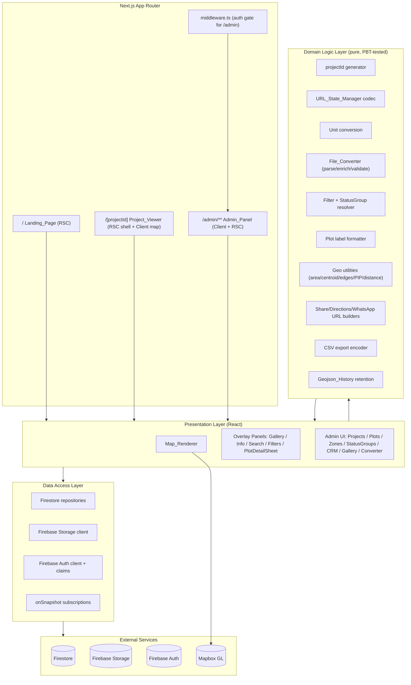
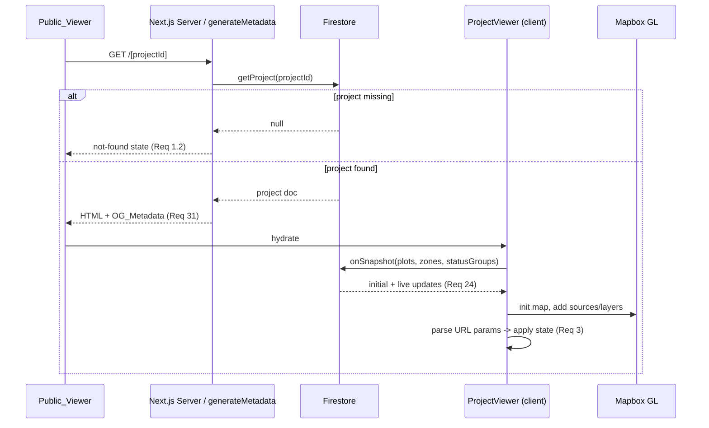
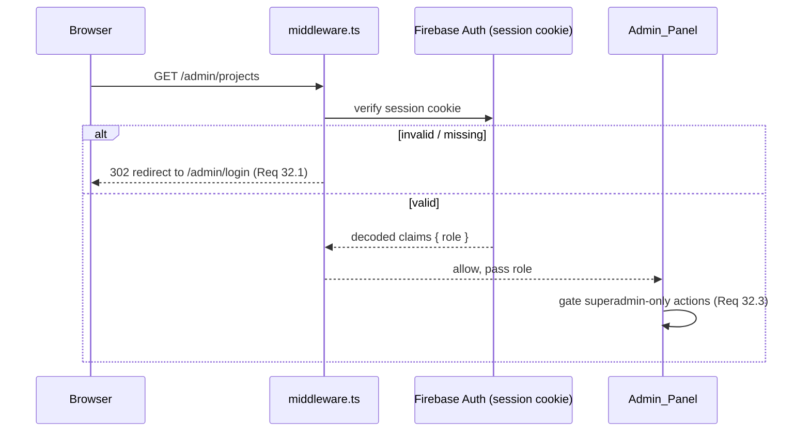

# Design Document

## Overview

PlotVerse is a real-time, mobile-first, installable web application for viewing and managing real-estate land plots on an interactive satellite map. The public experience is a single-page **Project_Viewer** served at `/[projectId]`, where the map and every panel (gallery, info, search, filters, plot details, location) are presented as sliding overlays without route navigation. A marketing **Landing_Page** lives at `/`, and a middleware-protected **Admin_Panel** lives under `/admin` for managing projects, plots, zones, status groups, gallery media, geospatial uploads, and a CRM lead pipeline.

This design proposes a full greenfield stack because the workspace is empty apart from the spec. The dominant technical signals in the requirements — server-side per-project Open Graph/SEO metadata (Req 31), middleware-enforced admin auth and roles (Req 32), a single dynamic route segment with overlay panels (Req 1), and Firebase real-time data (Req 24) — point strongly to **Next.js (App Router) on TypeScript with Firebase**. The geospatial and conversion requirements (Req 27, 34, 36) point to **Mapbox GL JS** for rendering and **Turf.js** plus format-specific parsers for the **File_Converter**.

### Goals

- Render one project per short URL with full-screen Mapbox satellite/street/3D maps and color-coded plot/zone layers.
- Keep shareable view state (`status`, `plot`, `zone`, `view`, `tab`) in URL query params via history replacement.
- Stream inventory changes from Firestore into the existing map source in real time.
- Convert seven geospatial file formats into validated, enriched GeoJSON with versioned history and rollback, preserving geometry exactly (round-trip integrity).
- Protect the admin surface at the middleware layer with role-based access (superadmin, editor) and manage a CRM lead pipeline.
- Ship as an installable PWA with mobile-app viewport behavior.

### Key Technology Decisions

| Concern | Decision | Rationale |
| --- | --- | --- |
| Framework | Next.js 14+ App Router (TypeScript) | Server-rendered `generateMetadata` per project (Req 31), `middleware.ts` for `/admin` auth (Req 32.4), dynamic `/[projectId]` segment (Req 1), file-based routing for `/` and `/admin`. |
| Map engine | Mapbox GL JS | Satellite/street styles, 3D pitch + fill-extrusion building layers, GeoJSON sources, feature-state hover/selection, expressions for data-driven color (Req 4–9, 27). |
| Database | Cloud Firestore | Document IDs equal Project_ID (Req 2.2), `onSnapshot` real-time subscriptions (Req 24), collections for projects/plots/zones/statusGroups/leads. |
| File storage | Firebase Storage | GeoJSON files and gallery media (Req 35.1, 39.1). |
| Auth | Firebase Auth + custom claims | Roles (superadmin, editor) via custom claims; session cookie verified in middleware (Req 32). |
| Geospatial math | Turf.js | Area, centroid, point-in-polygon, distance, edge length/midpoint (Req 14.4, 26, 27, 34.2). |
| Format parsing | `@tmcw/togeojson` (KML/KMZ), `shpjs` (SHP ZIP), `jszip` (KMZ), `dxf-parser` (DXF), `papaparse` (CSV) | Established parsers per format; avoids hand-rolling conversion (Req 34.1). |
| Client state | Zustand store + URL_State_Manager | Lightweight reactive store for viewer UI; URL is the source of truth for shareable state (Req 3). |
| Styling | Tailwind CSS | Mobile-first overlay panels, sheets, FAB. |
| QR | `qrcode` | Canvas/PNG QR generation and download (Req 23). |
| PWA | Web App Manifest + service worker (`next-pwa` or custom) | Installability and Add-to-Home-Screen (Req 40). |
| Testing | Vitest + fast-check + Testing Library | Property-based testing of pure logic (Req 2, 3, 28, 34, 36); component/integration tests for UI and Firebase wiring. |

## Architecture

### Layered Architecture

The system is organized into layers so that the pure, property-testable domain logic is isolated from I/O (Firebase, Mapbox, browser APIs). This separation is what makes Requirements 2, 3, 28, 34, and 36 cheaply testable with hundreds of generated inputs.



### Routing and Rendering Strategy

- **`/` (Landing_Page)** — A React Server Component rendering marketing content only. It does not import the Mapbox/viewer bundle (Req 30.2).
- **`/[projectId]` (Project_Viewer)** — A server component shell that (a) loads the project document for `generateMetadata` (Req 31) and the not-found check (Req 1.2), then (b) mounts a client component (`<ProjectViewer>`) that owns the Mapbox map and all overlay panels. All panels are conditionally rendered overlays — no nested routes (Req 1.3–1.5).
- **`/admin/**` (Admin_Panel)** — Protected by `middleware.ts`. Sub-sections (projects, plots, zones, status groups, CRM, gallery, converter) are rendered within the `/admin` segment; they are functional sections, not public routes.



### Admin Auth Flow (Middleware-Enforced)

Authentication is enforced at the request middleware layer (Req 32.4) rather than per-page, so unauthenticated requests never reach admin content.



The session cookie is created by exchanging a Firebase ID token (client sign-in) for a server session cookie. The middleware verifies the cookie and reads the `role` custom claim. Role enforcement is applied in two places: coarse access at the middleware/layout (any valid admin), and fine-grained superadmin-only operations (e.g., destructive project deletes, user role changes) gated in the data-access layer and UI. Firestore Security Rules provide defense-in-depth so that even a forged client cannot write without the proper claim.

### Real-Time Data Strategy

The Project_Viewer subscribes to the project's `plots`, `zones`, and `statusGroups` subcollections via `onSnapshot` (Req 24.1). On each snapshot delta, the Map_Renderer updates features in the existing Mapbox GeoJSON source using `source.setData(...)` with the merged feature collection rather than removing and recreating the source (Req 24.2). Derived UI (status summary counts, Info_Panel stats) is computed from the same in-memory feature collection so it always reflects current inventory (Req 11.2, 22.3, 24.3).

### Map Layer Stack

Mapbox layers are ordered so zones sit behind plots (Req 9.3):

1. Base style (satellite or street) — Req 4.
2. `building-extrusions` (fill-extrusion) — visible only in 3D — Req 5.3.
3. `zone-fill` + `zone-outline` (dashed) + `zone-label` — Req 9.
4. `plot-fill` (data-driven color by status) — Req 6.2–6.5.
5. `plot-outline` (width increased on selected feature-state) — Req 6.6–6.7.
6. `plot-label` (label format expression) — Req 7.
7. `edge-dimension-labels` (symbol layer, `minzoom: 18`) — Req 27.
8. `user-location` (pulsing dot) + `accuracy-circle` — Req 25.

Style switches re-add layers 2–8 after `style.load` fires, because changing the base style discards custom layers (Req 4.4).

## Components and Interfaces

### Domain Logic Modules (pure, framework-free)

These modules contain no I/O and are the primary target of property-based testing.

#### `lib/projectId.ts`

```ts
// Req 2
const ALPHABET = "ABCDEFGHIJKLMNOPQRSTUVWXYZabcdefghijklmnopqrstuvwxyz0123456789";

/** Generates a candidate 5–6 char alphanumeric id. */
export function generateProjectIdCandidate(rng: () => number): string;

/** True iff id is 5–6 chars and all chars are in ALPHABET. */
export function isValidProjectId(id: string): boolean;

/** Generates an id not present in `existing`. Throws after maxAttempts. */
export async function generateUniqueProjectId(
  existing: (id: string) => Promise<boolean>, // returns true if taken
  rng?: () => number,
  maxAttempts?: number
): Promise<string>;
```

#### `lib/urlState.ts`

```ts
// Req 3, 5, 8, 12, 15, 16
export interface ViewerState {
  status?: string;   // status group id
  plot?: string;     // plot id
  zone?: string;     // zone id
  view?: "3d";       // only "3d" is meaningful
  tab?: "gallery";   // only "gallery" is meaningful
}

/** Serialize state to URLSearchParams (omits undefined keys). */
export function encodeViewerState(state: ViewerState): URLSearchParams;

/** Parse params into a typed state, dropping unknown/invalid values. */
export function decodeViewerState(params: URLSearchParams): ViewerState;

/**
 * Resolve a decoded state against actual project data, dropping references
 * that do not match an existing plot/zone/status group (Req 3.7).
 */
export function resolveViewerState(state: ViewerState, project: ProjectIndex): ViewerState;
```

The applied state is written back to the URL with `history.replaceState` (via Next's router `replace` with `scroll: false`) so there is no navigation (Req 3.1).

#### `lib/units.ts`

```ts
// Req 28, 16
export type Unit = "sqft" | "sqm" | "sqyd" | "acre" | "gunta";

/** Convert an area in square meters (canonical) to the target unit. */
export function fromSquareMeters(areaSqm: number, unit: Unit): number;

/** Convert a value in `unit` back to square meters. */
export function toSquareMeters(value: number, unit: Unit): number;

/** Format an area for display in the given unit. */
export function formatArea(areaSqm: number, unit: Unit): string;
```

Canonical storage is square meters; all conversions go through it so unit-to-unit conversions compose. Persistence to/from `localStorage` lives in a thin `useUnitPreference` hook that wraps these pure functions (Req 28.3–28.4).

#### `lib/converter/` (File_Converter)

```ts
// Req 34, 36
export type SourceFormat = "geojson" | "json" | "kml" | "kmz" | "shp-zip" | "dxf" | "csv";

export interface ConversionResult {
  featureCollection: GeoJSON.FeatureCollection;
  errors: ValidationError[];
}

/** Detect format from filename/MIME + content sniffing. */
export function detectFormat(file: { name: string; type: string }): SourceFormat | null;

/** Parse any supported format into a GeoJSON FeatureCollection. */
export function parseToGeoJSON(format: SourceFormat, content: ArrayBuffer | string): GeoJSON.FeatureCollection;

/** Add area (sqft, sqm, sqyd) and centroid to each feature's properties (Req 34.2). */
export function enrichFeatures(fc: GeoJSON.FeatureCollection): GeoJSON.FeatureCollection;

/** Validate WGS84 bounds and closed polygon rings (Req 34.3). */
export function validateGeoJSON(fc: GeoJSON.FeatureCollection): ValidationError[];

/** Stable, deterministic serialization used for Storage (Req 36.1). */
export function serializeGeoJSON(fc: GeoJSON.FeatureCollection): string;
export function deserializeGeoJSON(text: string): GeoJSON.FeatureCollection;
```

#### `lib/filters.ts`

```ts
// Req 12, 13, 14
export type StatusFilter = "all" | PlotStatus;

export function filterByStatus(plots: Plot[], filter: StatusFilter): Plot[];
export function filterByZone(plots: Plot[], zoneId: string): Plot[];
export function resolveStatusGroup(plots: Plot[], group: StatusGroup): Plot[];
export function searchByNumber(plots: Plot[], query: string): Plot[];
```

#### `lib/labels.ts`

```ts
// Req 7
export type LabelFormat = "number" | "number+area" | "number+price" | "custom";
export function formatPlotLabel(plot: Plot, format: LabelFormat, unit: Unit): string;
```

#### `lib/geo.ts`

```ts
// Req 14.4, 26, 27
export function areaSqm(feature: GeoJSON.Feature): number;
export function centroid(feature: GeoJSON.Feature): GeoJSON.Position;
export function edgeDimensions(feature: GeoJSON.Feature): Array<{ midpoint: GeoJSON.Position; lengthMeters: number }>; // Req 27.2
export function pointInPlot(point: GeoJSON.Position, plot: Plot): boolean; // Req 26
export function distanceMeters(a: GeoJSON.Position, b: GeoJSON.Position): number; // Req 14.4
```

#### `lib/links.ts`

```ts
// Req 17, 18, 19, 23
export function googleMapsDirections(dest: GeoJSON.Position): string;
export function appleMapsDirections(dest: GeoJSON.Position): string;
export function whatsappEnquiryUrl(phone: string, message: string): string; // URL-encoded (Req 19.1)
export function buildShareUrl(base: string, projectId: string, plotId?: string): string; // Req 18.1
```

#### `lib/csv.ts`

```ts
// Req 38.5
export function leadsToCsv(leads: Lead[]): string; // RFC-4180 escaping
```

#### `lib/history.ts`

```ts
// Req 35.2
/** Append a new version and keep only the most recent 5. */
export function retainRecentVersions<T>(history: T[], next: T, keep?: number): T[];
```

### Presentation Components (Project_Viewer)

| Component | Responsibility | Requirements |
| --- | --- | --- |
| `ProjectViewer` | Root client component; owns map ref, Zustand store, URL sync, subscriptions | 1, 3, 24 |
| `MapRenderer` | Mapbox init, layer stack, feature-state hover/selection, style switching, 3D pitch + extrusions, edge labels, user-location | 4–9, 25, 27 |
| `TopBar` | Project name, compass, Share, 3D, Locate controls | 10 |
| `StatusSummaryBar` | Live per-status counts | 11 |
| `FilterPills` | Status + zone filter pills | 12, 13 |
| `SearchControl` | Client-side plot-number search, distance display, fly-to | 14 |
| `BottomTabBar` | Gallery / Info / Locate tabs | 15 |
| `PlotDetailSheet` | Plot specs, unit toggle, directions, share, WhatsApp, enquiry form | 16–20 |
| `GalleryPanel` + `Lightbox` | Media grid + full-screen viewer (swipe/pinch/video) | 21 |
| `InfoPanel` | Live stats, description (read-more), ranges, amenities, QR, social links | 22, 23 |
| `WhatsAppFab` | Fixed always-visible WhatsApp button | 19.2–19.3 |
| `LocationLayer` | GPS watch, pulsing dot, accuracy circle, near-plot notification | 25, 26 |
| `UnitToggle` | Unit selection + persistence | 28 |
| `PresentationMode` | Hide chrome / restore on tap or Escape | 29 |
| `AddToHomeScreenPrompt` | 30s mobile install prompt | 40 |

### Presentation Components (Admin_Panel)

| Component | Responsibility | Requirements |
| --- | --- | --- |
| `AdminShell` | Auth-gated layout, role context, navigation across sections | 32, 33.1 |
| `ProjectsManager` | CRUD projects (id generation on create) | 2, 33.2 |
| `PlotsManager` | Edit plots, assign zones, label format | 33.3, 37.3 |
| `ZonesManager` | CRUD zones | 37.1 |
| `StatusGroupsManager` | CRUD status groups | 13.1, 37.2 |
| `FileConverterPanel` | Upload, convert, validate, preview, edit properties, save | 34, 35 |
| `GeojsonHistoryPanel` | List versions, rollback | 35.2–35.3 |
| `GalleryManager` | Upload/remove media, YouTube refs | 39 |
| `CrmBoard` | Lead list, detail, pipeline, timeline, notes, export, stats | 38 |

### Data Access Layer

```ts
// Firestore repositories (thin wrappers over typed converters)
export const projectRepo: {
  get(id: string): Promise<Project | null>;
  exists(id: string): Promise<boolean>;          // Req 2.3
  create(id: string, data: ProjectInput): Promise<void>; // Req 2.2
  update(id: string, patch: Partial<Project>): Promise<void>;
  remove(id: string): Promise<void>;             // superadmin only (Req 32.3)
};
export const plotRepo: { /* list, subscribe, upsertMany, update */ };
export const zoneRepo: { /* CRUD, subscribe */ };
export const statusGroupRepo: { /* CRUD, subscribe */ };
export const leadRepo: { /* create, list, update, addNote, subscribe */ };
export const storageClient: { uploadGeoJSON, uploadMedia, getDownloadUrl, listVersions };
```

## Data Models

All geometry is stored as WGS84 (EPSG:4326) GeoJSON (Req 34.3). Areas are stored in canonical square meters and converted for display.

### Firestore Collections

```
projects/{projectId}                         // document id == Project_ID (Req 2.2)
projects/{projectId}/plots/{plotId}
projects/{projectId}/zones/{zoneId}
projects/{projectId}/statusGroups/{groupId}
leads/{leadId}                               // references projectId + plotId
adminUsers/{uid}                             // role mirror (claims are source of truth)
```

### TypeScript Models

```ts
export type PlotStatus = "available" | "sold" | "reserved" | "blocked"; // Req 6

export interface Project {
  id: string;                 // 5–6 char alphanumeric (Req 2.1)
  name: string;
  description: string;
  center: GeoJSON.Position;
  defaultZoom: number;
  labelFormat: LabelFormat;   // Req 7
  contactPhone: string;       // WhatsApp (Req 19)
  socialLinks: Record<string, string>;
  amenities: string[];
  gallery: MediaItem[];       // Req 21, 39
  geojsonStoragePath: string; // current GeoJSON in Storage (Req 35.1)
  geojsonHistory: GeojsonVersion[]; // most recent 5 (Req 35.2)
  ogImageUrl?: string;        // Req 31
  createdAt: number;
  updatedAt: number;
}

export interface Plot {
  id: string;
  projectId: string;
  number: string;             // search key (Req 14.1)
  status: PlotStatus;
  geometry: GeoJSON.Polygon;  // WGS84 (Req 34.3)
  areaSqm: number;            // canonical (Req 34.2)
  centroid: GeoJSON.Position; // Req 34.2
  price?: number;
  facing?: string;
  amenities?: string[];
  zoneId?: string;            // Req 37.3
  customLabel?: string;       // Req 7.5
}

export interface Zone {
  id: string;
  projectId: string;
  name: string;               // Req 9.2
  geometry: GeoJSON.Polygon;
}

export interface StatusGroup {
  id: string;                 // referenced by `status` URL param (Req 13.3)
  projectId: string;
  name: string;               // Req 13.1
  statuses: PlotStatus[];     // selected criteria
}

export interface MediaItem {
  id: string;
  type: "image" | "video" | "youtube"; // Req 21.1
  storagePath?: string;       // image/video in Storage (Req 39.1)
  youtubeId?: string;         // Req 39.2
  thumbnailUrl?: string;
}

export type LeadStatus = "New" | "Contacted" | "Interested" | "Negotiating" | "Closed" | "Lost"; // Req 38.2

export interface LeadTimelineEntry {
  type: "status_change" | "note";   // Req 38.3–38.4
  at: number;
  by?: string;
  fromStatus?: LeadStatus;
  toStatus?: LeadStatus;
  note?: string;
}

export interface Lead {
  id: string;
  projectId: string;          // Req 20.2
  plotId?: string;
  name: string;
  contact: string;
  message: string;
  status: LeadStatus;         // starts "New" (Req 20.4)
  timeline: LeadTimelineEntry[];
  createdAt: number;
}

export interface GeojsonVersion {
  storagePath: string;
  savedAt: number;
  savedBy: string;
}

export type AdminRole = "superadmin" | "editor"; // Req 32
```

### Mapbox Source Model

A single `plots` GeoJSON source holds all plot features; properties carry `id`, `status`, `number`, computed label, and `zoneId` so layer expressions can drive color (Req 6), labels (Req 7), and filters (Req 12) without recreating the source on updates (Req 24.2). Feature-state holds transient `hover` and `selected` flags (Req 8). A separate `zones` source backs the zone layers (Req 9), and ephemeral sources back edge-dimension labels (Req 27) and user location (Req 25).

### Persisted Client State

- `localStorage["plotverse.unit"]`: the persisted `Unit_Preference` (Req 28.3–28.4).
- URL query params: the shareable view state (Req 3) — the URL, not localStorage, is the source of truth for shareable state.

## Correctness Properties

*A property is a characteristic or behavior that should hold true across all valid executions of a system — essentially, a formal statement about what the system should do. Properties serve as the bridge between human-readable specifications and machine-verifiable correctness guarantees.*

This feature is highly amenable to property-based testing because the domain logic layer (`lib/*`) is composed of pure functions over large input spaces: id generation, the URL-state codec, unit conversions, geospatial parsing/enrichment/validation, GeoJSON serialization, filtering, aggregation, and link builders. The prework consolidated many UI-bound or persistence-bound criteria into integration/example tests and merged redundant criteria into the minimal set of properties below. Each property is universally quantified and traces to the requirements it validates.

### Property 1: Project_ID format

*For any* sequence of random draws, every generated Project_ID candidate is between 5 and 6 characters long and contains only alphanumeric characters.

**Validates: Requirements 2.1**

### Property 2: Project_ID uniqueness

*For any* set of already-existing Project_IDs, the id returned by the unique-id generator is not a member of that set.

**Validates: Requirements 2.3**

### Property 3: URL state codec round-trip and omission

*For any* valid `ViewerState`, decoding the result of encoding it yields an equivalent `ViewerState`; and any field that is undefined in the state produces no corresponding query-parameter key (so disabling 3D removes `view`, closing the plot sheet removes `plot`, and so on).

**Validates: Requirements 3.1, 3.2, 3.3, 3.4, 3.5, 3.6, 5.4, 5.5, 8.4, 13.3, 14.3, 15.2, 16.3**

### Property 4: URL state resolves against project data

*For any* decoded `ViewerState` and any project index, resolving the state retains references (`plot`, `zone`, `status`) that exist in the project and drops references that do not exist, leaving the remaining valid fields unchanged.

**Validates: Requirements 3.7**

### Property 5: Plot label formatting

*For any* plot, unit, and configured label format, the produced label matches the format: `number` yields exactly the plot number; `number+area` contains the number and the area formatted in the unit; `number+price` contains the number and the price; `custom` yields exactly the plot's custom label text.

**Validates: Requirements 7.1, 7.2, 7.3, 7.4, 7.5**

### Property 6: Predicate filtering is sound and complete

*For any* list of plots and any selection criterion (status filter, zone filter, status group, or plot-number search), the filtered result contains exactly those plots that satisfy the criterion — every returned plot satisfies it (soundness) and no satisfying plot is omitted (completeness); the `all` status filter returns the entire list.

**Validates: Requirements 12.3, 12.4, 12.5, 13.2, 14.1**

### Property 7: Group-by-status counts partition the collection

*For any* collection of plots (or leads), the per-status counts sum to the size of the collection and each per-status count equals the number of items having that status; recomputing after the collection changes reflects the new collection.

**Validates: Requirements 11.1, 11.2, 22.3, 24.3, 38.6**

### Property 8: Price and area ranges equal dataset extremes

*For any* non-empty set of plots, the computed range minimum is less than or equal to the maximum, and the minimum and maximum equal the smallest and largest values present in the dataset.

**Validates: Requirements 22.1**

### Property 9: Unit conversion round-trip

*For any* area in square meters and any target unit, converting to the unit and back to square meters recovers the original value (within floating-point tolerance); conversions therefore compose consistently between any two units.

**Validates: Requirements 16.2, 28.2**

### Property 10: Unit preference persistence round-trip

*For any* unit preference, persisting it and then loading it returns the same unit.

**Validates: Requirements 28.3, 28.4**

### Property 11: Directions and share link well-formedness

*For any* destination coordinate, the Google Maps and Apple Maps directions URLs parse as valid URLs whose query encodes the destination latitude and longitude; and *for any* base URL, project id, and optional plot id, the share URL parses as a valid URL whose path contains the project id and whose `plot` parameter equals the plot id when supplied.

**Validates: Requirements 17.1, 17.2, 18.1**

### Property 12: WhatsApp message encoding round-trip

*For any* phone number and message text, the WhatsApp enquiry URL is a valid URL and decoding its message parameter recovers the original message exactly.

**Validates: Requirements 19.1**

### Property 13: QR code encodes the viewer URL

*For any* project viewer URL, decoding the generated QR code yields the same URL.

**Validates: Requirements 23.1**

### Property 14: Distance metric properties

*For any* two coordinates, the computed distance is non-negative, is symmetric (distance a→b equals distance b→a), and is zero when the two coordinates are identical.

**Validates: Requirements 14.4**

### Property 15: Point-in-plot detection

*For any* plot polygon, a point located inside the polygon (e.g., its centroid for a convex polygon) is detected as inside, and a point clearly outside the polygon's bounding box is detected as outside.

**Validates: Requirements 26.1**

### Property 16: Edge dimension computation

*For any* plot polygon with a closed ring, the number of computed edge labels equals the number of edges; each label's midpoint is the average of its edge's two endpoints; and each label's length is non-negative and equals the measured great-circle length of that edge.

**Validates: Requirements 27.2**

### Property 17: Real-time source delta application

*For any* in-memory feature collection and any single-plot update (add, modify, or remove), applying the delta produces a feature collection that reflects the change, preserves all other features unchanged, and contains no duplicate feature ids — without recreating the collection from scratch.

**Validates: Requirements 24.2**

### Property 18: Multi-format parse equivalence

*For any* set of WGS84 polygon geometries encoded into a supported source format (GeoJSON, JSON, KML, KMZ, SHP ZIP, DXF, or CSV), parsing the encoded content yields a GeoJSON FeatureCollection whose geometries are equivalent to the originals.

**Validates: Requirements 34.1**

### Property 19: Feature enrichment

*For any* GeoJSON FeatureCollection, after enrichment every feature carries area values in sqft, sqm, and sqyd that maintain the correct fixed ratios to one another, and a centroid that lies within the feature's bounding box.

**Validates: Requirements 34.2**

### Property 20: GeoJSON validation correctness

*For any* GeoJSON FeatureCollection, validation reports no errors if and only if all coordinates lie within WGS84 bounds (longitude in [-180, 180], latitude in [-90, 90]) and all polygon rings are closed; mutating a valid collection to place a coordinate out of bounds or to open a ring causes validation to report a corresponding error and withholds saving.

**Validates: Requirements 34.3, 34.4**

### Property 21: GeoJSON serialization round-trip integrity

*For any* converted GeoJSON FeatureCollection, deserializing its serialized form produces a FeatureCollection whose geometry coordinates are exactly equal to the converted geometry (round-trip integrity through storage).

**Validates: Requirements 36.1**

### Property 22: GeoJSON history retention

*For any* sequence of saved GeoJSON versions, the retained history contains at most 5 entries and equals the 5 most recently saved versions in order.

**Validates: Requirements 35.2**

### Property 23: Admin access policy

*For any* admin role and any action, the access decision permits the action if and only if the policy matrix allows that role to perform it; an editor is denied every action reserved for superadmin while a superadmin is permitted all actions.

**Validates: Requirements 32.2, 32.3**

### Property 24: OG metadata derivation

*For any* project, the generated OG_Metadata contains a non-empty title, description, and image, with the title and description derived from the project's stored name and description.

**Validates: Requirements 31.1, 31.2**

### Property 25: Enquiry form validation

*For any* enquiry form input, validation succeeds if and only if all required fields (name, contact, message) are present and the contact is well-formed; invalid input always yields a non-empty list of validation errors and submission is withheld.

**Validates: Requirements 20.3**

### Property 26: Lead status enum membership

*For any* candidate status value, a lead status change is accepted if and only if the value is one of New, Contacted, Interested, Negotiating, Closed, or Lost.

**Validates: Requirements 38.2**

### Property 27: Lead timeline append

*For any* lead and any sequence of operations (status changes and note additions), each operation appends exactly one timeline entry of the corresponding type, preserves all prior entries in order, and the resulting timeline length equals the number of operations applied.

**Validates: Requirements 38.3, 38.4**

### Property 28: Lead CSV export round-trip

*For any* list of leads, the exported CSV has one header row plus one row per lead, and parsing the CSV back recovers each lead's exported field values (special characters such as commas, quotes, and newlines survive escaping).

**Validates: Requirements 38.5**

### Property 29: Gallery media add/remove

*For any* gallery media list, adding a YouTube reference appends a single youtube media item carrying that id, and removing a media item by id yields a list without that id while leaving all other items intact.

**Validates: Requirements 39.2, 39.3**

## Error Handling

| Area | Condition | Handling | Requirement |
| --- | --- | --- | --- |
| Routing | Project_ID not found | Render not-found state for the path (no crash, no redirect loop) | 1.2 |
| URL state | Param references a missing plot/zone/status group | Drop the param, render default view, keep valid params | 3.7 |
| URL state | Malformed/unknown param values (e.g., `view=foo`) | Ignore via typed decode; only `view=3d` and `tab=gallery` are honored | 3.x |
| Map style | Custom layers lost after base-style change | Re-add layers/sources on `style.load` | 4.4 |
| Geolocation | Permission denied or unavailable | Inform the user that location is unavailable; viewer remains usable | 25.4 |
| File converter | Unsupported or undetectable format | Report a clear error; do not attempt conversion | 34.1 |
| File converter | Validation failure (non-WGS84, open rings) | Surface per-feature validation errors; disable Save until resolved | 34.3, 34.4 |
| File converter | Corrupt/parse failure (bad KMZ/SHP/DXF) | Catch parser exceptions, report which file/feature failed, withhold save | 34.1 |
| Enquiry form | Invalid input | Show field-level validation messages; block submission | 20.3 |
| Auth | Missing/invalid session cookie under `/admin` | Redirect to login at middleware; never render admin content | 32.1 |
| Auth | Editor attempts superadmin-only action | Deny at data-access layer and hide control in UI; enforced again by Firestore rules | 32.3 |
| Firestore | Subscription/network error | Surface a non-blocking error state; retain last-known inventory; auto-retry | 24.1 |
| Storage | GeoJSON/media upload failure | Report failure, do not advance history version, keep prior current version | 35.1 |
| Rollback | Selected history version unreadable | Report error, keep current version unchanged | 35.3 |
| QR/Share | Clipboard or share API unavailable | Fall back: native share → clipboard copy → manual URL display | 18.2, 18.3 |

General principles:
- Pure domain functions are total where practical and return typed `Result`/error arrays rather than throwing, so validation and conversion errors are data the UI can render.
- I/O boundaries (Firestore, Storage, Auth, geolocation, share/clipboard) wrap failures and degrade gracefully without taking down the single-page viewer.
- Firestore Security Rules provide server-side defense-in-depth behind the middleware auth gate.

## Testing Strategy

### Dual approach

- **Property-based tests** validate the 29 universal properties above across the pure domain layer (`lib/*`). These cover the high-value, input-sensitive logic: id generation, URL codec, unit conversion, filtering, aggregation, geospatial math, multi-format conversion, GeoJSON validation and round-trip integrity, link builders, history retention, lead timeline/CSV, and access policy.
- **Unit / example tests** cover specific behaviors, finite mappings, and edge cases: status→color mapping (Req 6.2–6.5), default-status-New on lead creation (Req 20.4), read-more threshold (Req 22.2), iOS directions branch (Req 17.3), and zoom threshold gating for edge labels (Req 27.1, 27.3).
- **Component/interaction tests** (Testing Library) cover overlay open/close while retaining the map (Req 1.3–1.5), top bar and tab controls (Req 10, 15), filter pills presence (Req 12.1–12.2), detail sheet contents (Req 16.1), gallery/lightbox (Req 21), presentation mode (Req 29), and the Add-to-Home-Screen timing prompt with fake timers (Req 40.2).
- **Integration tests** (Firebase emulator suite + mocked Mapbox) cover persistence and wiring that does not vary meaningfully with input: project/plot/zone/status-group/lead CRUD (Req 2.2, 33, 37), real-time subscription callbacks (Req 24.1), GeoJSON save/Storage/plot upsert and rollback (Req 35.1, 35.3, 36.2), gallery media upload (Req 39.1), and middleware auth redirect (Req 32.1, 32.4).
- **Smoke tests** verify one-time configuration: PWA manifest fields (Req 40.1) and viewport meta / 100dvh + overflow rules (Req 41).

### Tooling

- **Test runner:** Vitest (fast, TS-native, jsdom for component tests).
- **Property library:** fast-check. The team MUST NOT hand-roll property-test infrastructure.
- **Component testing:** @testing-library/react + user-event.
- **Firebase:** the Firebase Emulator Suite (Firestore, Auth, Storage) for integration tests.
- **Mapbox:** a mock map object exposing `setData`, `setPaintProperty`, `setFeatureState`, `setPitch`, `addLayer`, `flyTo`, and `style.load` so Map_Renderer logic is testable without a real GL context.

### Property test configuration

- Each property-based test MUST run a minimum of **100 iterations**.
- Each property test MUST implement exactly **one** correctness property from this document.
- Each property test MUST be tagged with a comment referencing the design property using the format:
  - **Feature: plotverse-platform, Property {number}: {property_text}**
- Custom fast-check arbitraries will be built for: WGS84 coordinates and closed-ring polygons, `Plot`/`Zone`/`StatusGroup`/`Lead` records, `ViewerState`, units, areas, admin roles/actions, and per-format encoders (GeoJSON/JSON/KML/KMZ/SHP-ZIP/DXF/CSV) used by Property 18.

### Coverage of geometry integrity (Requirement 36)

Round-trip integrity is the most critical correctness concern for this product, so it is validated at two levels: Property 18 (parse equivalence across all seven input formats), Property 19 (enrichment preserves geometry while adding derived fields), Property 20 (validation gate), and Property 21 (serialize→deserialize geometry equality). Integration test 36.2 then confirms a file stored in Storage renders with matching polygon coordinates in the mocked Map_Renderer source, closing the loop from upload to display.
